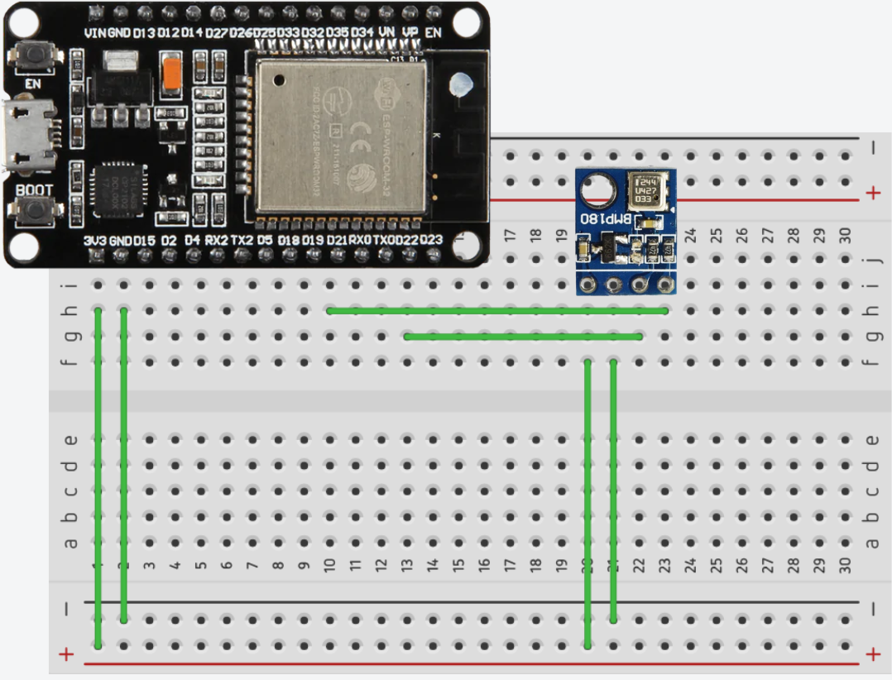

# BMP180

Para o uso do BMP180 no sistema, utilizamos as informações contidas no site do [ESPHome BMP085 Temperature+Pressure Sensor](https://esphome.io/components/sensor/bmp085/). Apesar de ser do sensor BMP085, a configuração do BMP180 segue a mesma lógica.

## Comunicação

O sensor BMP180 utiliza o protocolo de comunicação $I^2C$ (Inter-Integrated Circuit), esse protocolo é um barramento de comunicação serial síncrono. Ele permite a conexão de múltiplos dispositivos utilizando apenas duas linhas de comunicação.

O sensor BMP180 possui as seguintes entradas:

SDA (Serial Data)
- Linha bidirecional responsável pela transmissão de dados
- No projeto, conectada ao pino GPIO26 do ESP32

SCL (Serial Clock)
- Linha de clock gerada pelo dispositivo mestre (ESP32)
- Sincroniza a transmissão de dados entre os dispositivos
- Define a velocidade de comunicação (frequência)
- No projeto, conectada ao pino GPIO27 do ESP32

## Implementação

Para conecta-lo ao Home Assistant foi necessário ajustar o arquivo de configuração yaml do ESPHome para ler os dados captados do sensor.

Arquivo de configuração .yaml:
```yaml
i2c:
  sda: 26
  scl: 27
  scan: true
  id: bus_a
  
sensor:
    - platform: bmp085
        address: 0x77
        temperature:
        name: "Temperatura BMP180"
        id: bmp180_temp
        filters:
            - offset: 0.0 
        pressure:
        name: "Pressão"
        id: bmp180_pressao
        filters:
            - offset: 0.0 
        update_interval: 5s
```
- Parâmetros configuráveis: 
    - temperature: A informação do sensor de temperatura incluso.
        - Recebe todas as opções da configuração base dos sensores, consultado no seguinte site: [ESPHome Sensor Component](https://esphome.io/components/sensor/).
    - pressure: A informação do sensor de pressão atmosférica.
        - Recebe todas as opções da configuração base dos sensores, consultado no seguinte site: [ESPHome Sensor Component](https://esphome.io/components/sensor/).
    - address (Opcional, int): Especificar manualmente o endereço de conexão $I^2C$. Padrão é 0x77.
    - update_interval (Opcional, Time): Intervalo entre os monitoramentos. Padrão é 60s.

## Circuito




***

# BMP180

For using the BMP180 in the system, we utilized the information contained on the [ESPHome BMP085 Temperature+Pressure Sensor](https://esphome.io/components/sensor/bmp085/) website. Although it's for the BMP085 sensor, the BMP180 configuration follows the same logic.

## Communication

The BMP180 sensor uses the $I^2C$ (Inter-Integrated Circuit) communication protocol, this protocol is a synchronous serial communication bus. It allows the connection of multiple devices using only two communication lines.

The BMP180 sensor has the following inputs:

SDA (Serial Data)
- Bidirectional line responsible for data transmission
- In the project, connected to GPIO26 pin of the ESP32

SCL (Serial Clock)
- Clock line generated by the master device (ESP32)
- Synchronizes data transmission between devices
- Defines the communication speed (frequency)
- In the project, connected to GPIO27 pin of the ESP32

## Implementation

To connect it to Home Assistant, it was necessary to adjust the ESPHome yaml configuration file to read the data captured from the sensor.

Configuration file .yaml:
```yaml
i2c:
  sda: 26
  scl: 27
  scan: true
  id: bus_a
  
sensor:
    - platform: bmp085
        address: 0x77
        temperature:
        name: "BMP180 Temperature"
        id: bmp180_temp
        filters:
            - offset: 0.0 
        pressure:
        name: "Pressure"
        id: bmp180_pressao
        filters:
            - offset: 0.0 
        update_interval: 5s
```
- Configurable parameters:
    - temperature: The included temperature sensor information.
        - Accepts all options from the sensor base configuration, found on the following website: [ESPHome Sensor Component](https://esphome.io/components/sensor/).
    - pressure: The atmospheric pressure sensor information.
        - Accepts all options from the sensor base configuration, found on the following website: [ESPHome Sensor Component](https://esphome.io/components/sensor/).
    - address (Optional, int): Manually specify the $I^2C$ connection address. Default is 0x77.
    - update_interval (Optional, Time): Interval between monitoring. Default is 60s.

## Circuit


